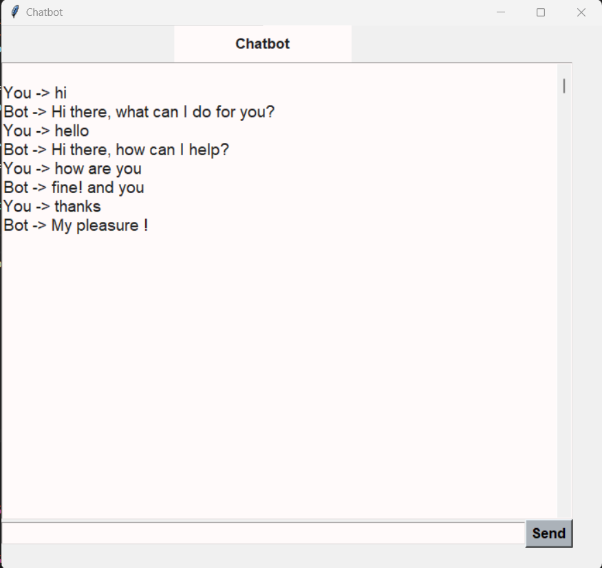

# Python ChatBot:

## GUI chat application using Tkinter in Python

### Chatbots are computer program that allows user to interact using input methods. The Application of chatbots is to interact with customers in big enterprises or companies and resolve their queries.  Chatbots are mainly built for answering standard FAQs.

The benefit of this type of system is that customer is no longer required to follow the same traditional mean of communication Instead they can just chat with the bot and can resolve their query.

#### This is a simple GUI (Graphical User Interface) chat application where users can interact with the bot.

